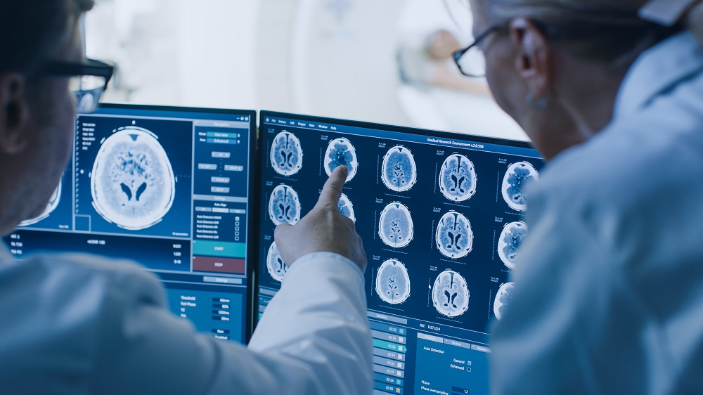
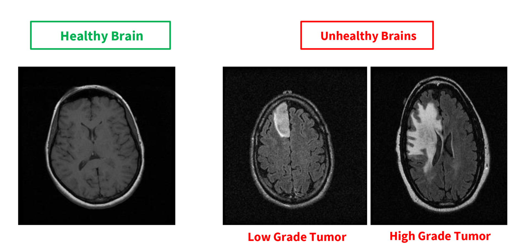
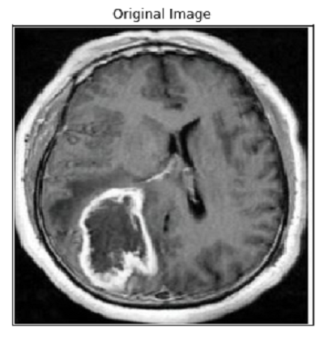
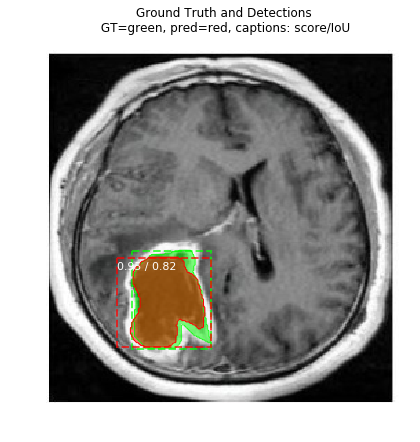
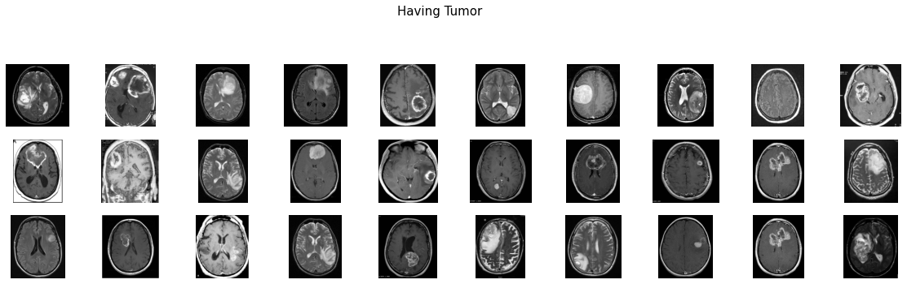
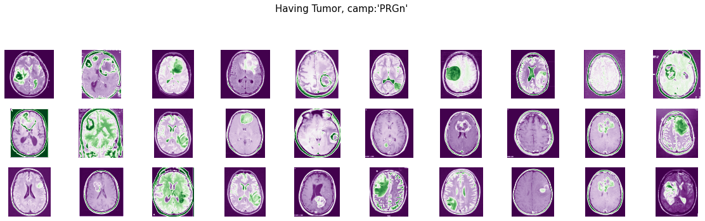
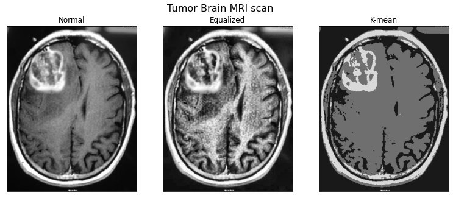
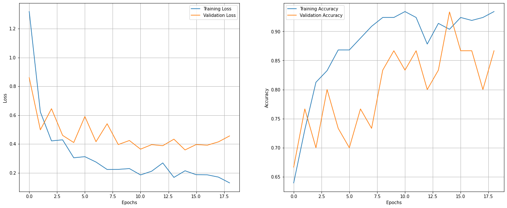
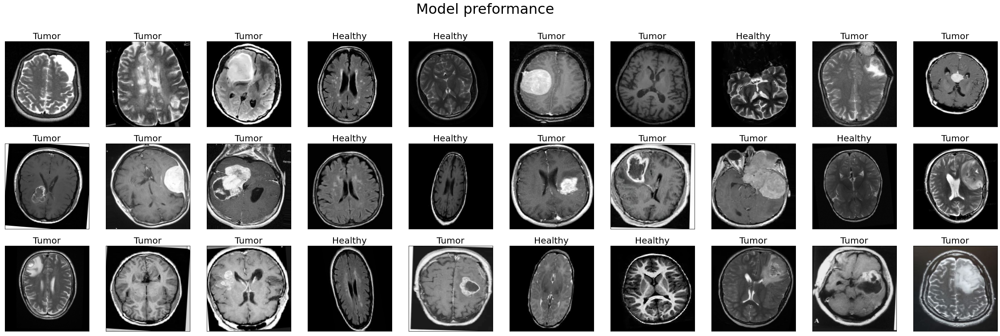
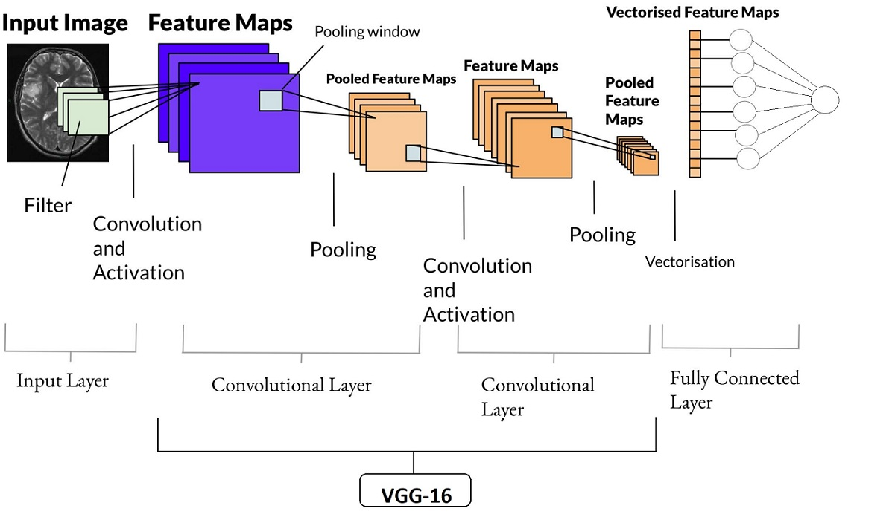

# Brain-Tumor-Diagnosis-and-Detection🕵

## Abstract:
Brain tumors vary in their position, mass, nature, and consistency of these lesions. Due to the similarities found between brain lesions and normal tissues, many challenges are faced by the researcher in developing algorithms for tumor segmentation. Brain tumor abstraction is thought-provoking job in medical image handing out because brain image and its structure is complicated.

Get **MOTIVATED** from **Michigan Medicine's** <a href="https://youtu.be/UZZ08_fC7UU">YouTube</a> Video. 

Optical imaging and artificial intelligence are making brain tumor diagnosis quicker and more accurate.

This Project aim for providing the **Baseline TUMOR detection and classification models using MASK-RCNN(detection) and DEEP LEAARNING CLASSIFICATION TECHNIQUES**.

<table>
  <tr>
    <td><strong>TUMOR CLASSIFICATION</strong></td>
     <td><strong>TUMOR DETECTION</strong></td>
  </tr>
  <tr>
    <td></td>
    <td>

  
  

</td>
  </tr>
 </table>

## Part I:
### **Image Data Analysis and Classification**

The main purpose of this project(part i) is to Analysis Image Data and ultimately to build a **CNN model** that would classify if subject has a tumor or not baised on MRI scan. I used the **VGG-16** model architecture and weights to train the model for this binary problem. I used `accuracy` as a metric to justify the model.

**Visit NOTEBOOK for PROJECT PART(I)** 

**Table of Contents** :
* 
Image Data Loading...

* 
Visualizing with Colormaps

  
  

 

* 
Equalized Hist Technique and K-Means clustring

* 
Edge detection

* 
Model traning (VGG-16)

  
  

 

* 
Tesing model performance

* 
Model Evaluation

  

Tumor Detection
<table border="0">
 <tr>
    <td><b style="font-size:30px"> Accuracy</b></td>
    <td><b style="font-size:30px">Precision</b></td>
   <td><b style="font-size:30px">F1-Score</b></td>
 </tr>
 <tr>
    <td>90%</td>
    <td>86%</td>
   <td>92%</td>
 </tr>
</table>
 

#### Classify on You own image📷:

* Download **Python Script** and **Model weights**.
* Make sure they are loaded in same directory.
* Run .py Scripts as below:
     
     `python tumor_classify_vgg16.py  relative_path/img.jpg`
     
     
     
     
## Part II:
